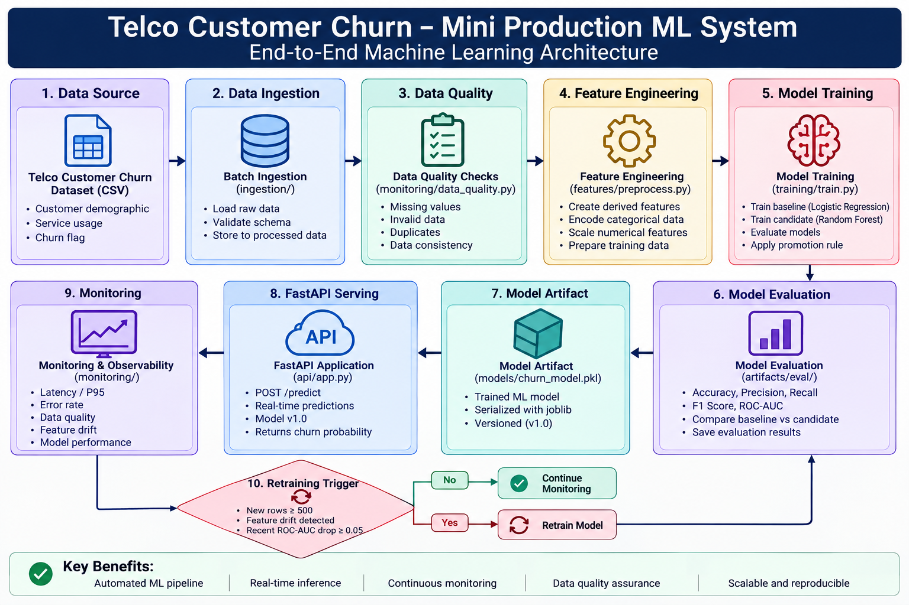

# Telco Customer Churn – Mini Production ML System

## 1. Project Overview

This project implements a mini production-oriented machine learning system for predicting customer churn.

The system demonstrates the complete ML lifecycle:

- Data ingestion
- Data quality validation
- Feature engineering
- Model training
- Offline model evaluation
- Model selection
- Model artifact storage
- FastAPI online inference
- Latency and throughput benchmarking
- Data and feature monitoring
- Retraining trigger logic
- Basic automated testing

The project uses the Telco Customer Churn dataset and implements binary classification to predict whether a customer is likely to churn.

---

## 2. Problem Definition

Customer churn prediction is a binary classification problem.

The model predicts:

- `0` → Customer is unlikely to churn
- `1` → Customer is likely to churn

The system is designed to support customer-service or retention teams by providing a churn probability for an individual customer.

### Primary Evaluation Metric

ROC-AUC is used as the primary model-selection metric because it evaluates the model's ability to distinguish between customers who churn and customers who do not across different classification thresholds.

Additional metrics include:

- Accuracy
- Precision
- Recall
- F1-score

---

## 3. Architecture

The overall system architecture is shown below.



The pipeline follows:

**Data Source → Ingestion → Data Quality → Feature Engineering → Training → Evaluation → Model Artifact → FastAPI Serving → Monitoring → Retraining**

---

## 4. Dataset

The project uses the Telco Customer Churn dataset.

The dataset contains customer demographic information, account information, service information and the target churn label.

Important fields include:

- Customer ID
- Gender
- Senior citizen status
- Partner and dependent status
- Tenure
- Internet service
- Contract type
- Payment method
- Monthly charges
- Total charges
- Churn

The `Churn` column is the target variable.

### Data Cleaning

The preprocessing workflow includes:

- Numeric conversion of `TotalCharges`
- Missing-value handling
- Duplicate checks
- Validation of expected columns
- Categorical encoding
- Numerical scaling
- Removal of identifier fields from model features

---

## 5. Feature Engineering

The project creates additional features from the raw customer attributes.

Examples include:

- `AverageMonthlySpend`
- `ServiceCount`
- `IsMonthToMonth`
- `HasOnlineSecurity`
- `HasTechSupport`
- `IsHighMonthlyCharge`
- `TenureGroup`

Feature preprocessing is shared between training and inference to reduce the risk of training-serving skew.

The preprocessing pipeline handles:

- Numerical imputation
- Numerical scaling
- Categorical encoding
- Unknown categorical values

### Offline vs Online Features

The engineered features are calculated from customer attributes available during both training and inference.

In a larger production system, these feature definitions could be maintained in a shared feature table or feature store so that offline training and online serving use the same feature definitions.

---

## 6. Data Ingestion

A simple batch ingestion process is implemented in:

`ingestion/ingest.py`

The ingestion process:

1. Reads a new CSV batch.
2. Validates the incoming data.
3. Appends the new records to the training-data file.
4. Records the ingestion event.
5. Stores an ingestion log containing information such as the number of rows processed.

Example input:

`data/new_data/daily_batch.csv`

The resulting training data is stored under:

`data/processed/training_data.csv`

---

## 7. Model Training

Two models are evaluated.

### Baseline

Logistic Regression

### Candidate

Random Forest

The training pipeline:

1. Loads the cleaned dataset.
2. Creates engineered features.
3. Splits the data into training, validation and test sets.
4. Applies preprocessing.
5. Trains the baseline model.
6. Trains the candidate model.
7. Compares validation metrics.
8. Applies a model promotion rule.
9. Evaluates the selected model on the test set.
10. Saves the production model artifact.

Training script:

`training/train.py`

---

## 8. Model Promotion Rule

The candidate model is promoted only when:

- ROC-AUC is at least `0.80`
- Candidate ROC-AUC is not more than `0.01` worse than the baseline

### Validation Results

| Model | ROC-AUC |
|---|---:|
| Logistic Regression | 0.8509 |
| Random Forest | 0.8380 |

The Random Forest candidate was therefore not promoted.

The selected production model is:

**Logistic Regression**

This demonstrates a production trade-off where a more complex model is not automatically selected unless it provides sufficient improvement.

---

## 9. Final Test Performance

The selected Logistic Regression model achieved:

| Metric | Result |
|---|---:|
| Accuracy | 0.7985 |
| Precision | 0.6650 |
| Recall | 0.4875 |
| F1-score | 0.5626 |
| ROC-AUC | 0.8464 |

The model is not intended to be state-of-the-art. The main objective is to demonstrate a reproducible production ML workflow.

The trained model is saved as:

`models/churn_model.pkl`

The evaluation report is saved as:

`artifacts/eval/evaluation.json`

---

## 10. Online Inference

The trained model is exposed through a FastAPI service.

### Endpoint

`POST /predict`

The endpoint accepts customer information as JSON and returns the model prediction and probability.

The API also provides a health endpoint:

`GET /health`

API implementation:

`api/app.py`

The selected production model is loaded from the saved model artifact so that the serving layer uses the evaluated model.

---

## 11. API Performance

A simple benchmark was performed using multiple prediction requests.

| Metric | Result |
|---|---:|
| Average latency | 47.53 ms |
| P50 latency | 46.89 ms |
| P95 latency | 63.07 ms |
| P99 latency | 124.11 ms |
| Approximate throughput | 21.04 requests/sec |

These measurements were obtained in a Google Colab development environment and should not be interpreted as production capacity guarantees.

The benchmark results are stored in:

`artifacts/performance/api_benchmark.json`

---

## 12. Monitoring

The monitoring design covers three areas.

### Infrastructure Metrics

- Average latency
- P95 latency
- Error rate
- Request throughput

### Data and Feature Metrics

- Number of incoming rows
- Missing values
- Invalid values
- Feature distribution changes
- Basic feature drift

### Model and Business Metrics

- Accuracy
- Precision
- Recall
- ROC-AUC
- Customer retention/business KPI when labelled feedback becomes available

---

## 13. Data Quality Monitoring

The data-quality check is implemented in:

`monitoring/data_quality.py`

The check validates basic data conditions such as missing values and expected data quality.

Example monitoring result:

```text
{'status': 'PASS', 'issues': []}
```

---

## 14. Feature Drift Monitoring

Feature drift detection is implemented in:

`monitoring/drift_check.py`

The current lightweight check compares the reference and recent mean of `MonthlyCharges`.

### Observed Result

| Metric | Result |
|---|---:|
| Reference mean | 64.7617 |
| Recent mean | 64.2485 |
| Relative change | 0.79% |
| Drift threshold | 20% |
| Drift detected | No |

Therefore, the current recent batch does not trigger a drift alert.

---

## 15. Retraining Strategy

The retraining policy is implemented in:

`monitoring/retraining.py`

Retraining is triggered when any of the following conditions occurs:

### Trigger 1 – New Data

`New rows >= 500`

### Trigger 2 – Feature Drift

`Significant feature drift detected`

### Trigger 3 – Model Degradation

`Recent ROC-AUC falls by >= 0.05 from baseline`

The baseline ROC-AUC is `0.8509`, so a recent ROC-AUC of approximately `0.8009` or lower would trigger retraining.

The current monitoring run produced:

```text
Retrain: False
Reason: No retraining trigger
```

---

## 16. Incident Scenario

### Scenario: Upstream Schema Change

An upstream data source may rename or remove an expected column such as `MonthlyCharges`.

The data-quality and ingestion stages should detect the schema problem before the data is used for retraining.

The response would be:

1. Reject or quarantine the invalid batch.
2. Generate a monitoring alert.
3. Investigate the upstream schema change.
4. Correct the ingestion mapping.
5. Re-run data-quality checks.
6. Recalculate features.
7. Retrain only after the data passes validation.

If a faulty model had already been deployed, the previous known-good model artifact could be restored.

---

## 17. Testing

Basic automated testing is implemented using Pytest.

Test file:

`tests/test_features.py`

Current test result:

```text
1 passed
```

The test verifies that the feature-generation process produces the expected engineered features.

---

## 18. Reproducibility

The project is organised into separate modules rather than relying on one notebook.

Important components include:

```text
api/          → FastAPI inference service
features/     → Feature engineering and preprocessing
ingestion/    → Batch data ingestion
training/     → Model training pipeline
monitoring/   → Data quality, drift and retraining checks
tests/        → Automated tests
models/       → Trained model artifact
artifacts/    → Evaluation and benchmark results
docs/         → Architecture and design documentation
```

The main training pipeline can be executed with:

```bash
python training/train.py
```

Tests can be executed with:

```bash
pytest tests/test_features.py -v
```

The FastAPI service can be started with:

```bash
uvicorn api.app:app --host 0.0.0.0 --port 8000
```

---

## 19. Key Trade-offs and Limitations

### Model Complexity

Logistic Regression was selected instead of Random Forest because it achieved better ROC-AUC while being simpler and easier to interpret.

### Monitoring

The current drift detector is intentionally lightweight and uses a relative mean-change threshold. A production system could use statistical drift tests or a dedicated monitoring platform.

### Deployment

The current API was tested in a Google Colab development environment. Production deployment would require a persistent server or cloud/container environment.

### Retraining

Retraining triggers are implemented as simple Python logic. A production environment could connect these triggers to a scheduler, model registry and CI/CD workflow.

### Data

The system uses a historical public dataset. Real-world deployment would require continuously updated customer data and reliable labelled outcomes.

---

## 20. Future Work

Possible future improvements include:

- Docker/container deployment
- CI/CD pipeline
- Cloud deployment
- Model registry
- Automated scheduled retraining
- Advanced statistical drift detection
- Feature store
- Centralized monitoring dashboard
- Automated alerting
- Model explainability
- Continuous labelled-feedback collection

---

## 21. Repository Structure

```text
telco-churn-mini-production-ml/
│
├── api/
├── artifacts/
├── data/
├── docs/
├── features/
├── ingestion/
├── models/
├── monitoring/
├── tests/
├── training/
│
├── .gitignore
├── README.md
└── requirements.txt
```

The `docs/` directory contains the architecture diagram and the design document submitted with the project.

---

## 22. Project Summary

This project demonstrates a complete mini production ML lifecycle:

**Data → Validation → Features → Training → Evaluation → Model Selection → Artifact → API Serving → Monitoring → Retraining**

The implementation focuses on reproducibility, modular code, measurable inference performance, basic automated testing and explicit production trade-offs rather than state-of-the-art model accuracy.
